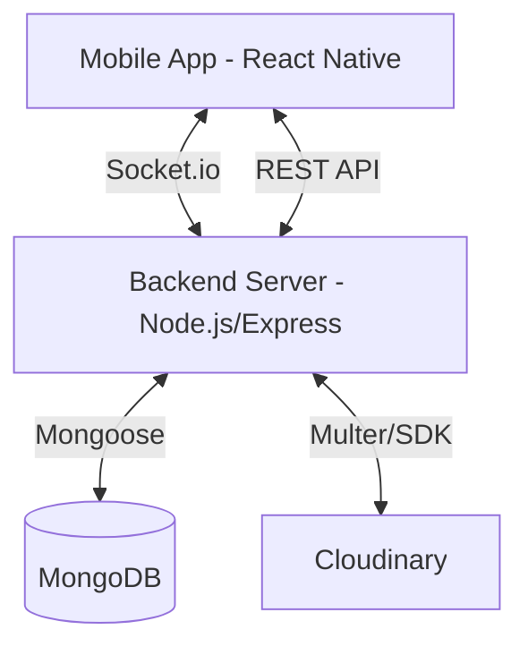
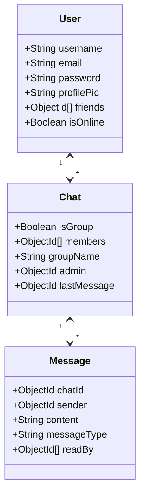

# Baat Cheet — System Architecture

This document describes the high-level architecture and data flow of the Baat Cheet messaging application.

## System Overview

Baat Cheet follows a client-server architecture with real-time bidirectional communication.

## Component Breakdown

### 1. Frontend (Mobile)
- **Framework**: Expo (React Native)
- **Navigation**: React Navigation (Stack + Bottom Tabs)
- **State Management**: React Context API (`AuthContext`, `SocketContext`)
- **Real-time**: Socket.io-client
- **UI Components**: custom `MessageBubble`, `ChatItem`, and `UserItem`

### 2. Backend (Server)
- **Framework**: Express.js
- **Database**: MongoDB with Mongoose ODM
- **Real-time**: Socket.io
- **Security**: JWT for authentication, bcrypt for password hashing
- **File Handling**: Multer (Memory Storage) + Cloudinary SDK

### 3. External Services
- **MongoDB Atlas**: Cloud-hosted NoSQL database
- **Cloudinary**: Media management service for image hosting

## Data Flow

### Real-time Messaging
1. User A sends a message via Socket event `new message`.
2. Server receives the event, persists the message to MongoDB.
3. Server identifies active members of the chat room.
4. Server emits `message recieved` to User B's personal room.

### Image Sharing
1. User selects image via `expo-image-picker`.
2. Image is sent as `multipart/form-data` to `/api/messages/upload`.
3. Server (Multer) receives file and uploads directly to Cloudinary.
4. Cloudinary returns a secure URL.
5. Frontend receives URL and sends it as a `messageType: 'image'` message via Socket.

## Database Schema

